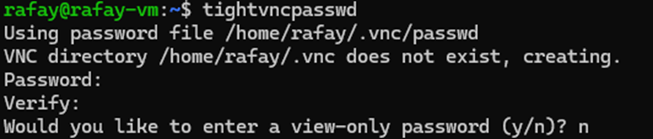

# NIM Workshop Preparation

---

# 1. Prepare NFS Server

Reference: https://www.tecmint.com/install-nfs-server-on-ubuntu/

## (OPTIONAL) Create New Partition

```bash
sudo fdisk /dev/sda
```

```bash
sudo partprobe /dev/sda
sudo mkfs.ext4 /dev/sda4
```

## 1.1 Install NFS Server

```bash
sudo apt install -y nfs-kernel-server
```

## 1.2 Create NFS Export Directory

```bash
sudo mkdir -p /nfs-share
```

```bash
# OPTIONAL
sudo mount /dev/sda4 /nfs-share
```

Since we want all the client machines to access the shared directory, remove any restrictions in the directory permissions.

```bash
sudo chown -R nobody:nogroup /nfs-share/
```

You can also tweak the file permissions to your preference. Here’s we have given the read, write and execute privileges to all the contents inside the directory.

```bash
sudo chmod 777 /nfs-share/
```

## 1.3 Grant NFS Share Access to NFS Clients

```bash
sudo vim /etc/exports
```

```
/nfs-share  11.22.33.0/24(rw,sync,no_subtree_check)
```

Export the NFS share directory and restart the NFS kernel server for the changes to come into effect.

```
sudo exportfs -a
```

```
sudo systemctl restart nfs-kernel-server
```

Allow access through the firewall

```bash
sudo ufw allow from 11.22.33.0/24 to any port nfs
```

```bash
sudo ufw enable && \
	sudo ufw status
```

---

# 2. Create Student VMs

1. Attach GPU to virtual machine in ***passthrough mode***
    1. Ensure virtual machine’s memory is fully reserved
    
2. Set the following advanced parameters
    
    ```
    Attritube: pciPassthru.use64bitMMIO
    Value: TRUE
    ```
    
    ```
    # For A100 or H100 GPUs
    Attritube: pciPassthru.64bitMMIOSizeGB
    Value: 256
    ```
    
    <aside>
    📝
    
    Should you attach multiple passthrough GPUs to the VM, the value for `pciPassthru.64bitMMIOSizeGB` has to be adjusted proportionately.
    
    </aside>
    

---

# 3. Prepare Student VMs

## 3.1 Install Docker Engine

1. Install Ubuntu Server 22.04.5 LTS as the Operating System
    
    
2. Install `nvidia-smi`
    
    ```bash
    sudo apt update && \
    	sudo apt upgrade -y && \
    	sudo reboot
    ```
    
    ```bash
    sudo apt install -y xorg && \
    	sudo apt install -y nvidia-driver-550 && \
    	sudo reboot
    ```
    
3. Install Docker Engine
    
    ```bash
    curl -fsSL https://get.docker.com -o docker.sh && \
    	sudo sh docker.sh
    ```
    
4. Install `nvidia-container-toolkit` 
    
    ```bash
    curl -fsSL https://nvidia.github.io/libnvidia-container/gpgkey | sudo gpg --dearmor -o /usr/share/keyrings/nvidia-container-toolkit-keyring.gpg \
      && curl -s -L https://nvidia.github.io/libnvidia-container/stable/deb/nvidia-container-toolkit.list | \
        sed 's#deb https://#deb [signed-by=/usr/share/keyrings/nvidia-container-toolkit-keyring.gpg] https://#g' | \
        sudo tee /etc/apt/sources.list.d/nvidia-container-toolkit.list
    
    ```
    
    ```bash
    sudo apt-get update && \
    	sudo apt-get install -y nvidia-container-toolkit
    ```
    
    ```bash
    sudo nvidia-ctk runtime configure --runtime=docker && \
    	sudo systemctl restart docker
    ```
    
5. (OPTIONAL) Disable NVLink
    - More Info
        
        This might be required for SXM GPUs that is interconnected via NVLink.
        
    
    ```bash
    echo "options nvidia NVreg_NvLinkDisable=1" | \
    	sudo tee /etc/modprobe.d/disable-nvlink.conf
    ```
    
    ```bash
    sudo update-initramfs -u && \
    	sudo reboot
    ```
    
6. Verify
    
    ```bash
    docker run --rm --gpus all nvcr.io/nvidia/k8s/cuda-sample:vectoradd-cuda11.7.1-ubuntu20.04
    ```
    

## 3.2 Setup NFS

1. Install NFS Client libraries
    
    ```bash
    sudo apt install nfs-common -y
    ```
    
2. Create NFS mount point
    
    ```bash
    sudo mkdir -p /mnt/nfs-share
    ```
    
3. Mount NFS
    
    ```bash
    sudo mount <NFS-SERVER-IP>:/nfs-share /mnt/nfs-share
    ```
    
4. Make NFS auto-mount during boot by adding the following entry in `/etc/fstab`
    
    ```
    <NFS-SERVER-IP>:/nfs-share /mnt/nfs-share nfs defaults,_netdev,auto,nofail 0 0
    ```
    

## 3.3 Install Firefox Browser

- More Info
    
    The following steps install Firefox browser NOT using snap. This is because the snap installation of Firefox has some compatibility issues with VNC.
    
1. Add the repository for Firefox
    
    ```bash
    sudo add-apt-repository ppa:mozillateam/ppa && \
    	sudo apt-get update
    ```
    
2. Specify preference for our specified repository over snap for Firefox
    
    ```bash
    echo '
    Package: *
    Pin: release o=LP-PPA-mozillateam
    Pin-Priority: 1001
    
    Package: firefox
    Pin: version 1:1snap*
    Pin-Priority: -1' | sudo tee /etc/apt/preferences.d/mozilla-firefox
    ```
    
3. Install Firefox
    
    ```bash
    sudo apt install -y firefox
    ```
    

## 3.4 Install TightVNC

1. Install TightVNC server and other required packages
    
    ```bash
    sudo apt update && \
    	sudo apt install tightvncserver gnome-panel gnome-settings-daemon metacity nautilus gnome-terminal xserver-xorg-core dbus-x11 -y
    ```
    
2. Create a password needed for remote connection.
    
    ```bash
    tightvncpasswd
    ```
    
    
    
3. Add a service definition file to start VNC when booted up
    
    ```bash
    sudo vim /etc/systemd/system/vncserver@.service
    ```
    
    ```
    [Unit]
    Description=Start TightVNC server at startup
    After=syslog.target network.target
     
    [Service]
    Type=forking
    User=user1
    Group=user1
    WorkingDirectory=/home/user1
     
    PIDFile=/home/user1/.vnc/%H:%i.pid
    ExecStartPre=-/usr/bin/vncserver -kill :%i > /dev/null 2>&1
    ExecStart=/usr/bin/vncserver -depth 16 -geometry 1280x800 :%i
    ExecStop=/usr/bin/vncserver -kill :%i
     
    [Install]
    WantedBy=multi-user.target
    ```
    
    <aside>
    📝
    
    The above example is for the user: `user1`. 
    
    Replace it according to your specific setup.
    
    </aside>
    
4. Create a startup script for gnome session
    
    ```bash
    vim ~/.vnc/xstartup
    ```
    
    ```bash
    #!/bin/bash
     
    unset SESSION_MANAGER
    unset DBUS_SESSION_BUS_ADDRESS
     
    [ -x /etc/vnc/xstartup ] && exec /etc/vnc/xstartup
    [ -r $HOME/.Xresources ] && xrdb $HOME/.Xresources
     
    export XKL_XMODMAP_DISABLE=1
    export XDG_CURRENT_DESKTOP="GNOME-Flashback:Unity"
    export XDG_MENU_PREFIX="gnome-flashback-"
     
    gnome-session --session=gnome-flashback-metacity --disable-acceleration-check &
    ```
    
5. Make sure the file is set to be executable
    
    ```bash
    chmod +x ~/.vnc/xstartup
    ```
    
6. Enable the service using command
    
    ```bash
    sudo systemctl enable vncserver@1.service && \
    	sudo systemctl start vncserver@1.service
    ```
    
    ```bash
    sudo systemctl status vncserver@1.service
    ```
    

## 3.5 Install Additional Libraries

```bash
sudo apt install -y jq
```

---

# 4. Create Mapping Entries for Student VMs in Guacamole Server

1. Create entries for Student VMs in guacamole in `/etc/guacamole/user-mapping.xml`
    
    Below is the sample entry for ***EACH*** VM:
    
    ```xml
        <!-- password: P@ssw0rd -->
        <authorize username="student1" password="161ebd7d45089b3446ee4e0d86dbcf92" encoding="md5">
          <connection name="vnc">
            <protocol>vnc</protocol>
            <param name="hostname"><Student-VM-IP></param>
            <param name="port">5901</param>
            <param name="username">user1</param>
            <param name="password">P4ssword!</param>
          </connection>
          <connection name="SSH">
            <protocol>ssh</protocol>
            <param name="hostname"><Student-VM-IP></param>
            <param name="port">22</param>
            <param name="username">user1</param>
            <param name="password">P4ssword!</param>
          </connection>
        </authorize>
    ```
    
    <aside>
    📝
    
    - `student1` is the login username used in Guacamole login page
    - `P@ssw0rd` is the login password used in Guacamole login page
        - In the example above, the password is being MD5 encoded.
    - There is one entry each for VNC and SSH
    </aside>
    
2. Save changes and restart the Tomcat and Guacamole services
    
    ```bash
    sudo systemctl restart tomcat guacd
    ```
    

---

# 5. Create Model Store for NIM

1. List the available model profiles
    
    ```bash
    docker run --rm --runtime=nvidia --gpus=all \
    	-e NGC_API_KEY=$NGC_API_KEY \
    	$IMG_NAME \
    	list-model-profiles
    
    ```
    
2. Pre-download the cache of the desired profile
    
    ```bash
    docker run -it --rm --gpus all \
    	-e NGC_API_KEY \
    	-v $LOCAL_NIM_CACHE:/opt/nim/.cache \
      $IMG_NAME \
      download-to-cache \
      -p <profile-id-or-profile-name>
    ```
    
3. Convert the cache to model store
    
    ```bash
     docker run -it --rm --gpus all \
    	 -e NGC_API_KEY \
    	 -v $LOCAL_NIM_CACHE:/opt/nim/.cache \
    	 $IMG_NAME \
    	 create-model-store \
    	 -p <profile-id-or-profile-name> \
    	 -m <destination-directory-in-nfs-server>
    ```
    

---

# 6. Student VMs Cleanup

1. Clear tmux sessions
    
    ```bash
    tmux kill-server
    ```
    
2. Delete docker install script
    
    ```bash
    sudo rm -f docker.sh
    ```
    
3. Clear the following directories
    - genai-perf
    - nim
    - tokenizer

1. Clear huggingface creds (if any)
    
    ```bash
    huggingface-cli logout
    ```
    
2. Clear docker login creds
    
    ```bash
    docker logout nvcr.io
    ```
    
3. Clear all containers
    
    ```bash
    cd GenerativeAIExamples/RAG/examples/basic_rag/langchain
    docker compose --env-file .env --profile local-nim --profile milvus down
    ```
    
    ```bash
    docker stop $(docker ps -aq)
    docker rm $(docker ps -aq)
    ```
    

1. Ensure NFS mounts upon startup
    
    ```bash
    cat /etc/fstab
    ```
    
2. Clear bash history
    
    ```bash
    sudo ls -l && cat /dev/null > ~/.bash_history && \
    	history -c && \
    	history -w && \
    	sudo shutdown now
    ```
    

---

# 7. Other Backups

1. Backup docker images
    
    ```bash
    docker save \
    	--output /mnt/nfs-share/images/llama-3.1-8b-instruct.tar \
    	nvcr.io/nim/meta/llama-3.1-8b-instruct:1.3.3
    ```
    
    ```bash
    # To load
    docker load < /mnt/nfs-share/images/llama-3.1-8b-instruct.tar
    ```