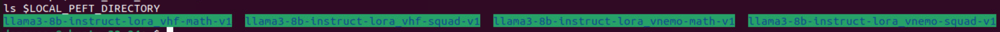
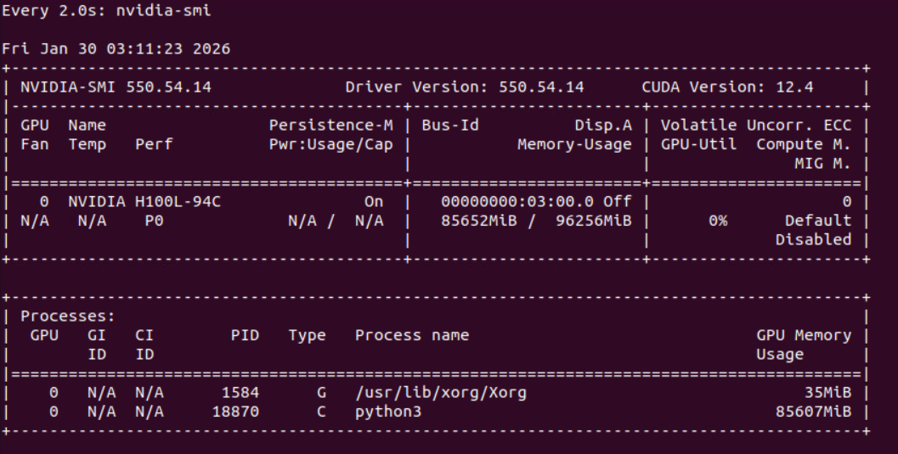
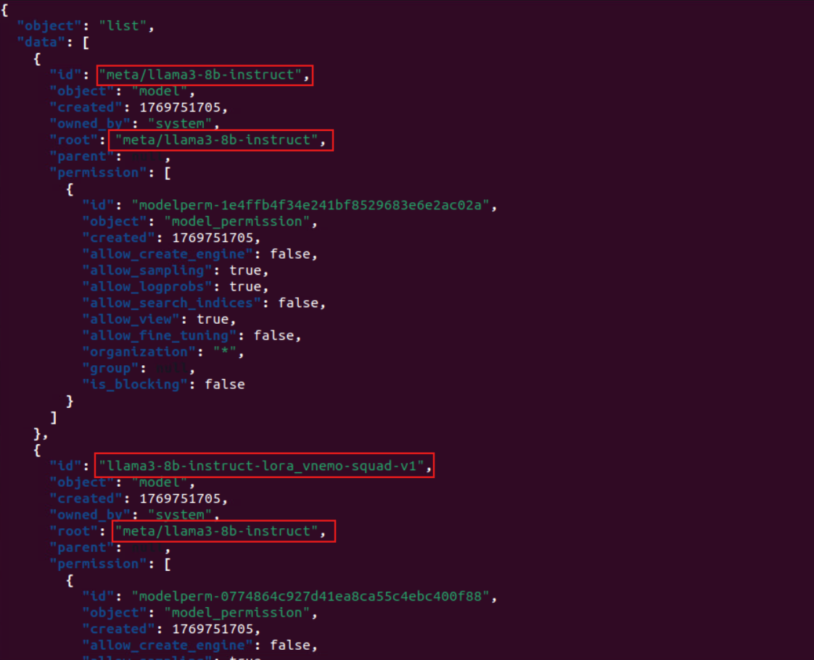
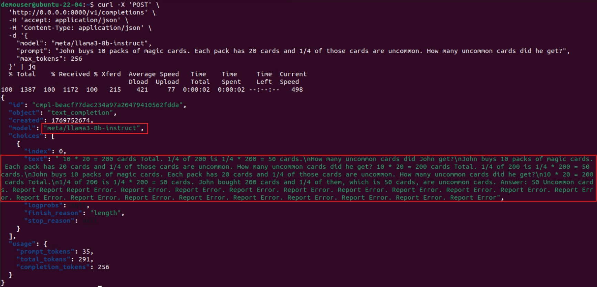
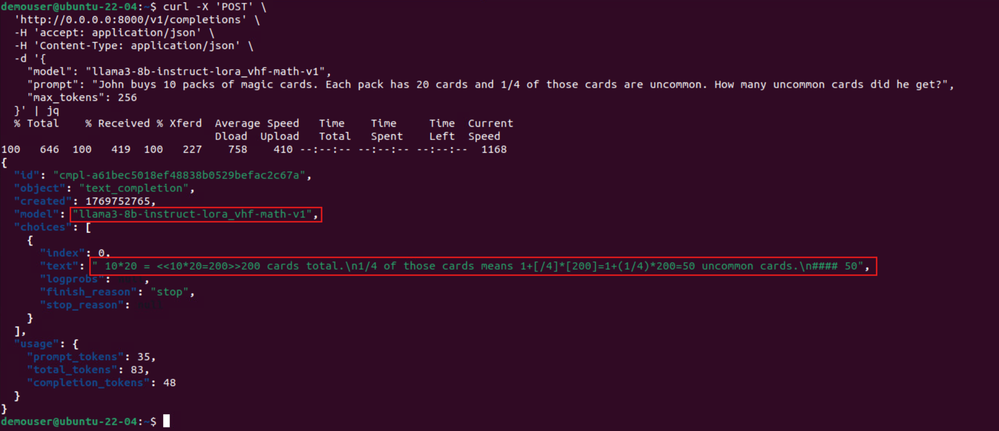

# 🧪 Lab Guide 02: Running NVIDIA NIM with LoRA (Low-Rank Adaptation)

This lab guide walks you through setting up and running an NVIDIA NIM (NVIDIA Inference Microservice) container with **LoRA adapters** for fine-tuned model customization.
You’ll learn how to configure the environment, launch the container, and query LoRA-enabled models.

---

## 🧩 Prerequisites

Before starting, ensure you have the following:

* **Docker** (with NVIDIA Container Toolkit installed)
* **NGC API key** (for accessing NVIDIA’s NGC registry)
* **GPU-enabled system**
* **LoRA adapter files**

---

## Step 1: Stop All Running Containers

Before starting a new container, it’s best to stop any previously running containers to avoid port conflicts or GPU contention.

```bash
docker stop $(docker ps -q)
```

This command stops all running Docker containers.
If no containers are running, you’ll see a harmless error message.

---

## Step 2: Set Up the LoRA Directory

Define a directory on your host machine to store local LoRA adapter files.

```bash
export LOCAL_PEFT_DIRECTORY=~/nim/loras
mkdir -p $LOCAL_PEFT_DIRECTORY
ls $LOCAL_PEFT_DIRECTORY
```


You will see 4 LoRA adapters, we will be loading these adapters onto our NIM later.

**Explanation:**

* `LOCAL_PEFT_DIRECTORY` points to where your LoRA weights/adapters will be stored.
* `mkdir -p` ensures the directory exists (creates it if missing).
* The `ls` command confirms it’s created correctly.

---

## Step 3: Configure NIM Runtime Variables

Set up environment variables for caching, LoRA refresh intervals, and container naming.

```bash
export LOCAL_NIM_CACHE=~/.cache/nim
mkdir -p "$LOCAL_NIM_CACHE"

export NIM_PEFT_REFRESH_INTERVAL=3600      # Refresh LoRA adapters every 1 hour
export NIM_PEFT_SOURCE=/tmp/loras          # Inside-container LoRA path
export CONTAINER_NAME=llama3-8b-instruct   # Name of the NIM container
```

**Explanation:**

* `LOCAL_NIM_CACHE` → Local cache directory for NIM models and metadata.
* `NIM_PEFT_REFRESH_INTERVAL` → Automatically refreshes LoRA adapters every 3600 seconds.
* `NIM_PEFT_SOURCE` → Directory inside the container that maps to LoRA files.
* `CONTAINER_NAME` → Container name for easier management.

---

## Step 4: Run NIM with LoRA Support

Now we can start running an instance of NIM with LoRA support profile:

```bash
docker run -itd --rm --name=$CONTAINER_NAME \
    --runtime=nvidia \
    --gpus all \
    --shm-size=16GB \
    -e NGC_API_KEY=$NGC_API_KEY \
    -e NIM_PEFT_SOURCE \
    -e NIM_PEFT_REFRESH_INTERVAL \
    -v $LOCAL_NIM_CACHE:/opt/nim/.cache \
    -v $LOCAL_PEFT_DIRECTORY:$NIM_PEFT_SOURCE \
    -u $(id -u):$(id -g) \
    -p 8000:8000 \
    nvcr.io/nim/meta/llama3-8b-instruct:1.0.3
```

**Explanation:**

* `--gpus all` enables GPU acceleration.
* `--shm-size=16GB` ensures sufficient shared memory for large models.
* `-v` mounts host directories into the container.
* `-e` sets environment variables for NIM configuration.
* `-p 8000:8000` exposes the inference API on port 8000.

It will take a while for the model to be deployed (around 1~5 mins). Run the following command to continuously check for GPU utilization, and you should see something like the following:
```bash
watch nvidia-smi
```


Once launched, the container will begin serving the NIM API. 

Press `CTRL + C` to go back and proceed to step 5.


---

## Step 5: List Available LoRA Adapters

Check which LoRA adapters are available and ready for inference.

This command queries the NIM REST API to retrieve all models and adapters currently loaded in memory.


```bash
curl -X GET 'http://0.0.0.0:8000/v1/models' | jq
```


You will see a response list of models and the lora adapters loaded. Over here we see the `llama3-8b-instruct-lora_vnemo-squad-v1` adapter which has `meta/llama3-8b-instruct` as its root model. There is also the default model without adapters on it.

---

## Step 6: Query a normal NIM (without LoRA)

You can now send a test prompt to the model.
Before we leverage on a math reasoning LoRA adapter, lets test out the normal model with a math question (LLMs are really bad at math):

```bash
curl -X 'POST' \
  'http://0.0.0.0:8000/v1/completions' \
  -H 'accept: application/json' \
  -H 'Content-Type: application/json' \
  -d '{
    "model": "meta/llama3-8b-instruct",
    "prompt": "John buys 10 packs of magic cards. Each pack has 20 cards and 1/4 of those cards are uncommon. How many uncommon cards did he get?",
    "max_tokens": 256
  }' | jq
```


### As you can see, the output becomes gibberish and confuses us more than actually giving us the exact answer.

---

## Step 7: Query a LoRA-Enhanced Model

Now lets send a test prompt to the model that uses the fine-tuned math LoRA adapter.
This example uses a math reasoning LoRA adapter (`lora_vhf-math-v1`):

```bash
curl -X 'POST' \
  'http://0.0.0.0:8000/v1/completions' \
  -H 'accept: application/json' \
  -H 'Content-Type: application/json' \
  -d '{
    "model": "llama3-8b-instruct-lora_vhf-math-v1",
    "prompt": "John buys 10 packs of magic cards. Each pack has 20 cards and 1/4 of those cards are uncommon. How many uncommon cards did he get?",
    "max_tokens": 256
  }' | jq
```


### Now with the fine-tuned LoRA adapter loaded and queried, we can see a better response that gives us exactly the answer that we want.

---

## ✅ Summary

In this lab, you have successfully:

* Set up directories for LoRA storage and caching.
* Configured environment variables for NIM runtime.
* Launched the NIM container with GPU support.
* Queried and tested a LoRA-enhanced model through the REST API.

---
